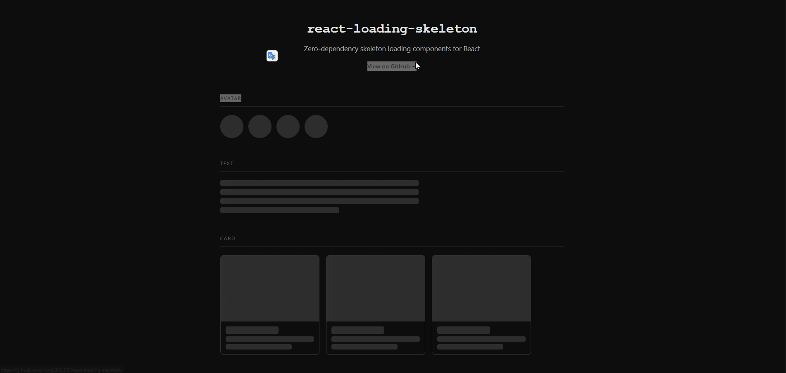

# react-loading-skeleton

> Zero-dependency React skeleton loading components — pixel-perfect placeholders for any UI loading state.

[](LICENSE)
[](https://typescriptlang.org)
[](https://reactjs.org)
[](#)

## Demo



## Features

- **Zero dependencies** — pure CSS shimmer animation, no extra packages
- **5 ready-to-use components** — Card, Text, Avatar, Table, List
- **Fully customizable** — control size, count, and border radius via props
- **Dark mode ready** — automatically adapts to system color scheme
- **Accessible** — `aria-hidden` applied, invisible to screen readers
- **TypeScript** — full type definitions included

## Getting Started

### Prerequisites

- Node.js 18+
- React 18+

### Installation

```bash
git clone https://github.com/long260398/react-skeletons-kit
cd react-loading-skeleton
npm install
npm run dev
```

Open [http://localhost:5173](http://localhost:5173) to see the live demo.

## Usage

Copy the `src/components/` folder into your project, then import and use:

```tsx
import { SkeletonCard, SkeletonText, SkeletonAvatar } from './components'

function UserProfile({ loading, user }) {
  if (loading) {
    return (
      <>
        <SkeletonAvatar size={64} />
        <SkeletonText lines={3} />
      </>
    )
  }
  return <div>{user.name}</div>
}
```

### Components

| Component | Key Props | Description |
|---|---|---|
| `<Skeleton />` | `width` `height` `borderRadius` | Base primitive — build any shape |
| `<SkeletonCard />` | `count` | Card placeholder with image + title + text |
| `<SkeletonText />` | `lines` `lastLineWidth` | Multi-line text block |
| `<SkeletonAvatar />` | `size` `count` | Circular avatar placeholder |
| `<SkeletonTable />` | `rows` `columns` | Data table row placeholders |
| `<SkeletonList />` | `count` `avatar` | List items with optional avatar |

### Example: Data table while fetching

```tsx
import { SkeletonTable } from './components'

function UsersPage({ loading, users }) {
  if (loading) return <SkeletonTable rows={10} columns={5} />
  return <table>...</table>
}
```

## Stack

- **Framework**: React 18 + TypeScript
- **Build tool**: Vite 5
- **Styling**: Pure CSS — no Tailwind, no styled-components

## Contributing

Pull requests are welcome. For major changes, open an issue first.

## License

[MIT](LICENSE)
